# 🏛 DermiAssist-AI: Comprehensive System Architecture & Schema Specification

**DermiAssist-AI** is an enterprise-grade medical AI platform designed as a **polyglot microservices architecture**. It couples a modern edge-rendered **Next.js 15** frontend with a high-throughput **Python FastAPI & LangGraph Multi-Agent** inference engine.

---

## 1. High-Level System Architecture Topology

The following diagram illustrates the end-to-end component layers, network boundaries, and real-time telehealth infrastructure:

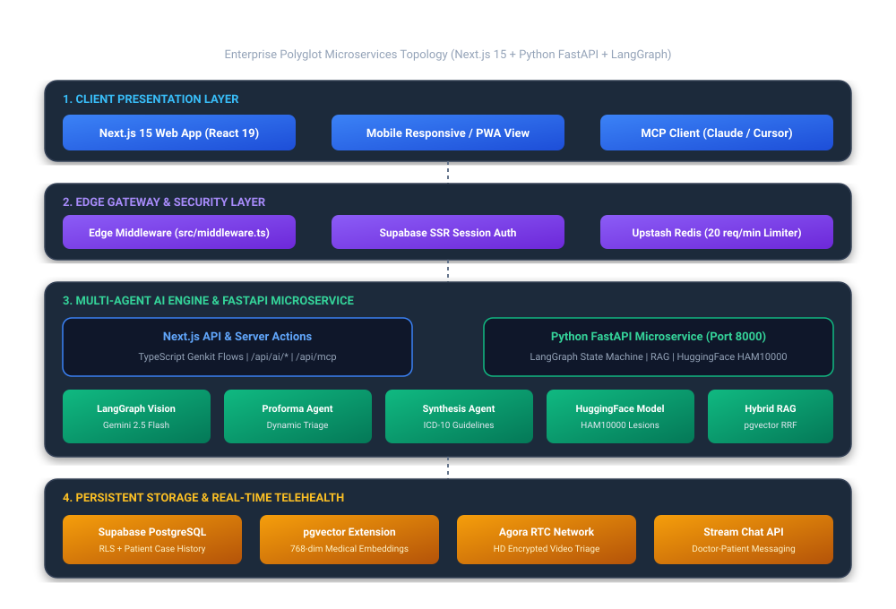

<details>
<summary><b>View Raw Mermaid Code</b></summary>

```mermaid
graph TB
    subgraph Client Layer [1. Client & Presentation Layer]
        WEB[Next.js 15 Web App<br/>React 19 / Tailwind / Radix]
        MOBILE[Mobile Viewports<br/>PWA & Touch Responsive]
        MCP_CLIENT[External MCP Clients<br/>Claude Desktop / Cursor]
    end

    subgraph Edge Layer [2. Edge Security & Session Gateway]
        MW[Edge Middleware<br/>src/middleware.ts]
        AUTH_GATE[Supabase SSR Session Auth]
        RATE_LIMIT[Upstash Redis Rate Limiter<br/>Sliding Window 20 req/min]
    end

    subgraph App Layer [3. Application & Microservices Layer]
        NEXT_API[Next.js API & Server Actions<br/>/src/app/api/* & Genkit Flows]
        MCP_SERVER[MCP Protocol Server<br/>/api/mcp JSON-RPC 2.0]
        FASTAPI[Python FastAPI AI Microservice<br/>/ai_service (Port 8000)]
    end

    subgraph LangGraph Layer [4. Multi-Agent AI Engine & LangGraph State Machine]
        LG_ENGINE[LangGraph State Machine<br/>DermatologyDiagnosticState]
        VISION_AGENT[Vision Diagnostic Agent<br/>Gemini 2.5 Flash / GPT-4o Vision]
        PROFORMA_AGENT[Dynamic Proforma Agent<br/>Contextual Question Branching]
        SYNTHESIS_AGENT[Differential Synthesis Agent<br/>ICD-10 & Treatment Pathways]
        HF_AGENT[Hugging Face Open-Source Agent<br/>HAM10000 Skin Lesion Classifier]
        RAG_ENGINE[Hybrid RAG Engine<br/>Dense pgvector + Sparse BM25 RRF]
    end

    subgraph Data Layer [5. Data & Storage Layer]
        SUPABASE_DB[(Supabase PostgreSQL<br/>Row Level Security & Partitions)]
        PGVECTOR[(pgvector Extension<br/>768-dim Clinical Embeddings)]
        CLOUDINARY[Cloudinary Media CDN<br/>Encrypted Image Storage]
    end

    subgraph Telehealth Layer [6. Real-Time Telehealth Infrastructure]
        STREAM_CHAT[Stream Chat Infrastructure<br/>Doctor-Patient Secure Messaging]
        AGORA_RTC[Agora WebRTC Network<br/>Low-Latency HD Video Consultations]
    end

    %% Flow connections
    WEB --> MW
    MOBILE --> MW
    MCP_CLIENT --> MCP_SERVER
    MW --> AUTH_GATE
    MW --> RATE_LIMIT
    MW --> NEXT_API

    NEXT_API <--> FASTAPI
    MCP_SERVER <--> FASTAPI
    FASTAPI --> LG_ENGINE
    
    LG_ENGINE --> VISION_AGENT
    LG_ENGINE --> PROFORMA_AGENT
    LG_ENGINE --> SYNTHESIS_AGENT
    LG_ENGINE --> HF_AGENT
    LG_ENGINE --> RAG_ENGINE

    NEXT_API <--> SUPABASE_DB
    FASTAPI <--> SUPABASE_DB
    RAG_ENGINE <--> PGVECTOR
    NEXT_API --> CLOUDINARY
    NEXT_API --> STREAM_CHAT
    NEXT_API --> AGORA_RTC
```
</details>

---

## 2. LangGraph Multi-Agent Clinical Diagnostic Flowchart

The AI diagnostic triage pipeline is modeled as a stateful, cyclical **LangGraph** multi-agent graph:

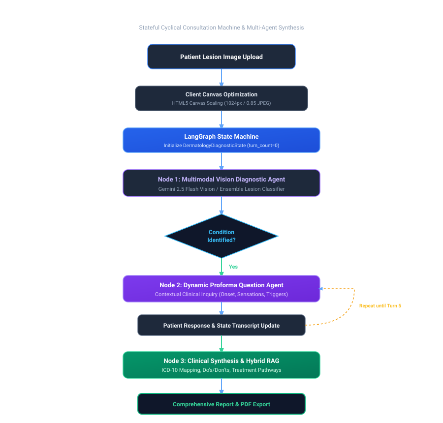

<details>
<summary><b>View Raw Mermaid Code</b></summary>

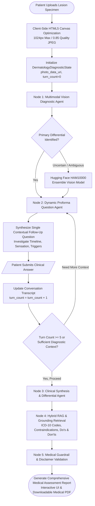
</details>

---

## 3. Database Entity Relationship Diagram (ERD)

The persistent database schema is structured on **Supabase PostgreSQL** with Row-Level Security (RLS) policies and pgvector embedding extensions:

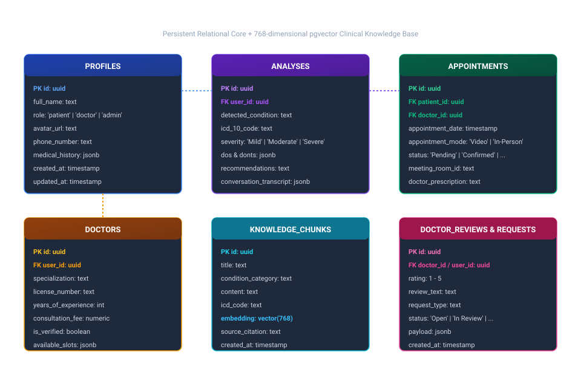

<details>
<summary><b>View Raw Mermaid Code</b></summary>

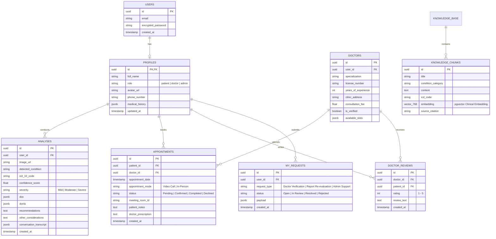
</details>

---

## 4. End-to-End Diagnostic Request Lifecycle

Sequence diagram illustrating the interaction between the patient, Next.js client, Edge proxy, Python LangGraph engine, and database:

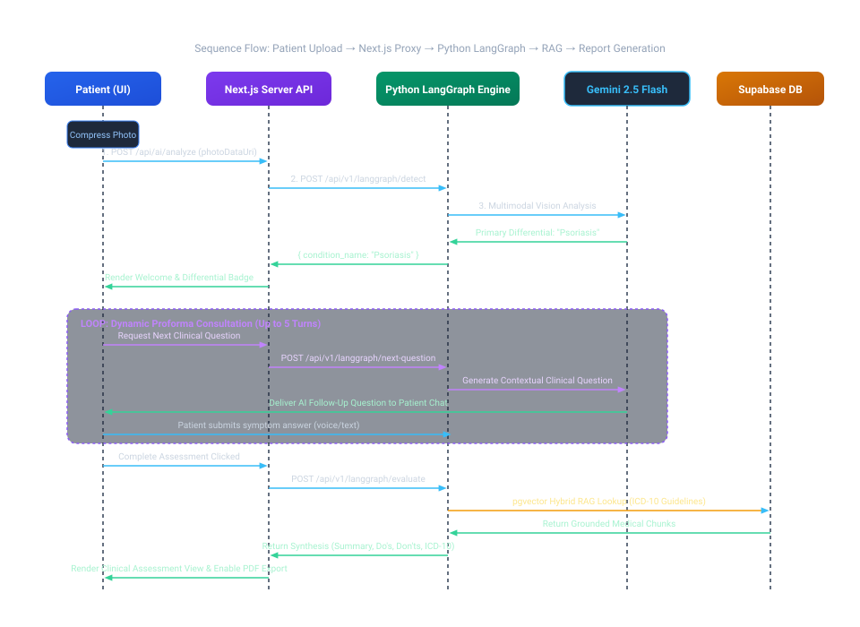

<details>
<summary><b>View Raw Mermaid Code</b></summary>

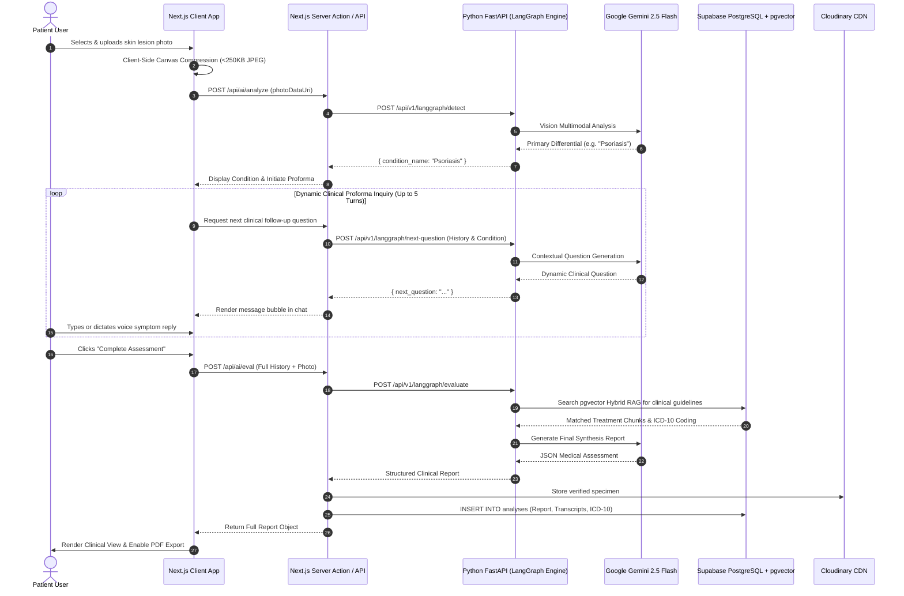
</details>

---

## 5. Telehealth Real-Time Consultation Architecture

Sequence diagram demonstrating the WebRTC video consultation and real-time chat lifecycle:

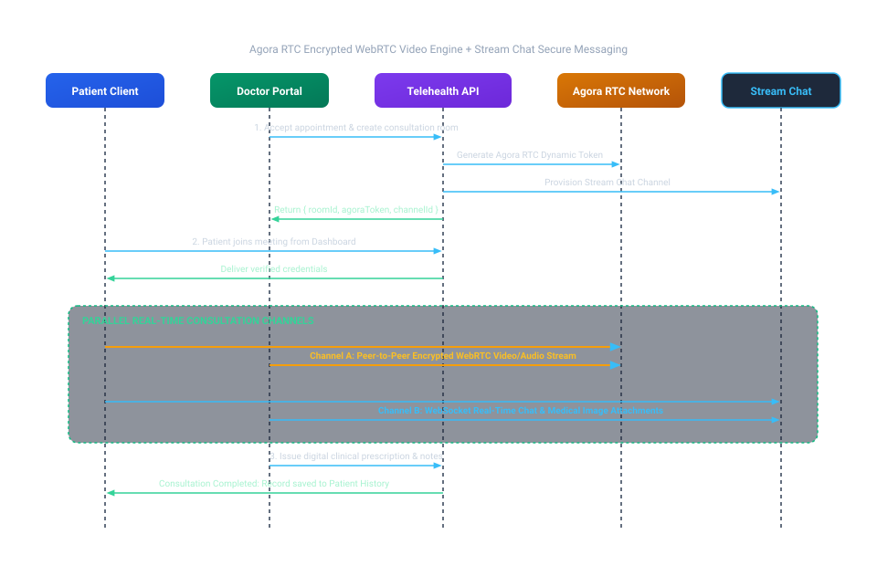

<details>
<summary><b>View Raw Mermaid Code</b></summary>

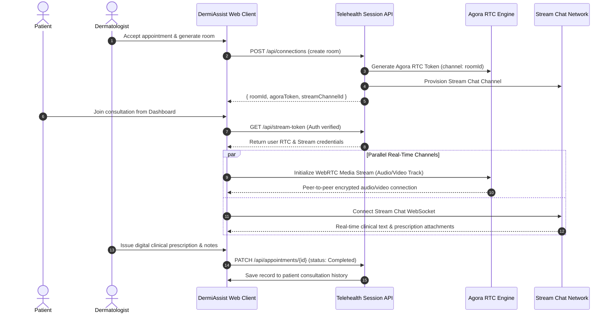
</details>

---

## 6. Distributed Security, Guardrails & Reliability Topology

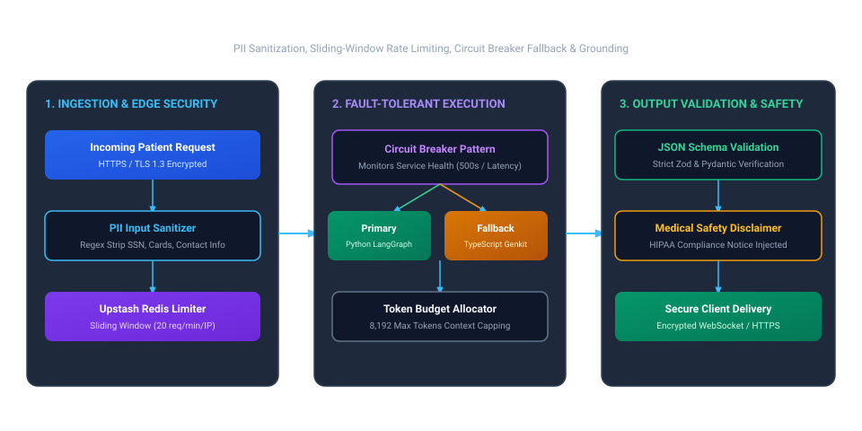

<details>
<summary><b>View Raw Mermaid Code</b></summary>

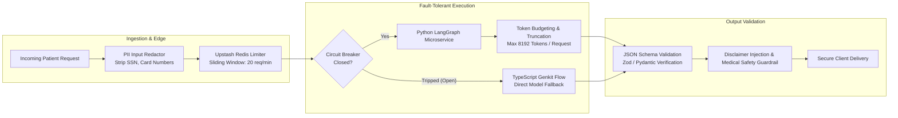
</details>


---

## 7. Technology Stack Reference Matrix

| Layer | Technologies & Frameworks | Purpose & Responsibility |
| :--- | :--- | :--- |
| **Frontend UI/UX** | Next.js 15 (App Router), React 19, TypeScript, Tailwind CSS, Lucide Icons, Radix UI | Responsive patient dashboard, dynamic proforma chat, doctor portal, real-time charts |
| **Microservices Backend** | Python 3.12, FastAPI, Uvicorn, Pydantic v2 | High-throughput AI microservice, REST API endpoints, OpenAPI documentation |
| **Multi-Agent AI Engine** | LangGraph, LangChain, Google GenAI SDK (Gemini 2.5 Flash), OpenAI GPT-4o | Stateful clinical graphs, vision diagnostic agents, proforma question branching, clinical synthesis |
| **Open-Source ML** | Hugging Face Transformers, HAM10000 Dataset, BAAI/bge-small-en-v1.5 | Open-source skin lesion classification and dense medical embeddings |
| **Database & Vector RAG**| Supabase PostgreSQL, `pgvector`, Row Level Security (RLS) | Relational case history, patient records, 768-dimensional clinical knowledge search |
| **Caching & Rate Limiting**| Upstash Redis, Python in-memory circuit breakers | Sliding-window DDoS mitigation, LLM cost budgeting, failover routing |
| **Real-Time Telehealth** | Agora RTC SDK (WebRTC), Stream Chat React SDK | Low-latency encrypted video consultations and doctor-patient messaging |
| **Reporting & Export** | jsPDF, html2canvas, Canvas Image Compression | Client-side HIPAA-compliant PDF assessment report generation |
