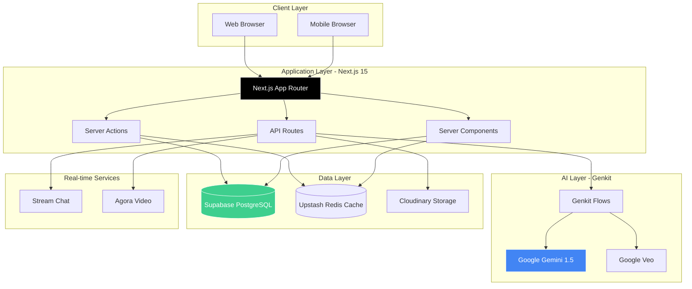
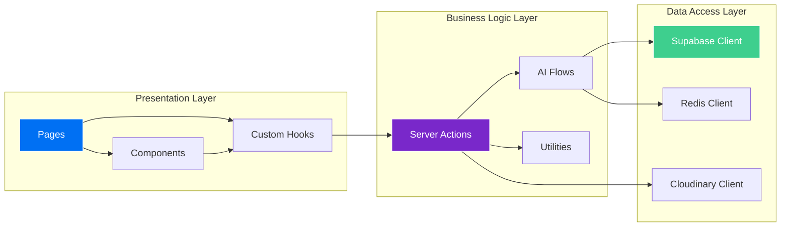
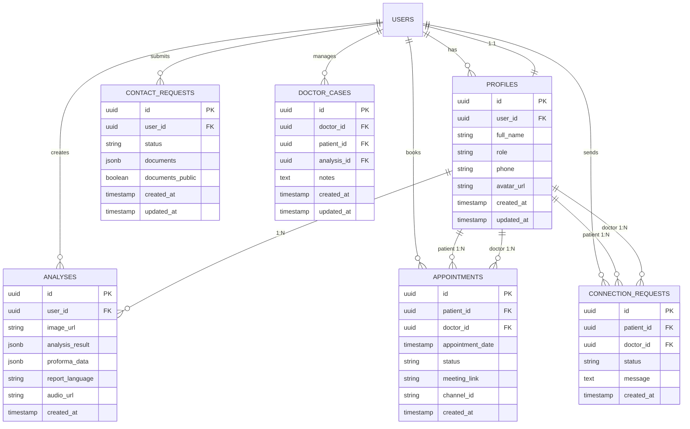
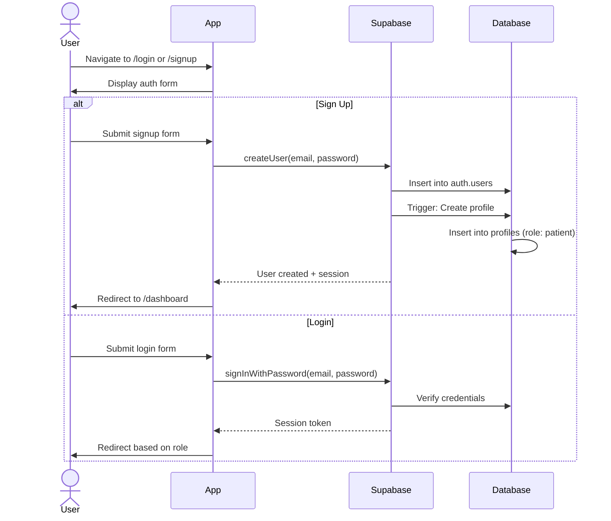
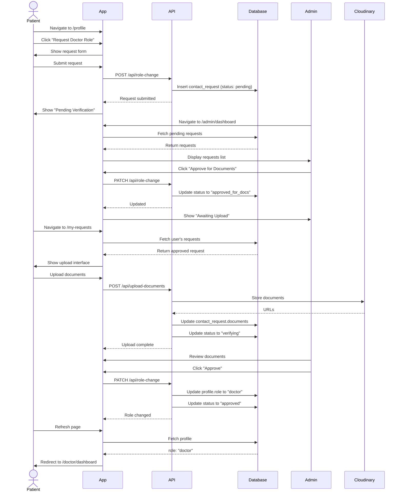
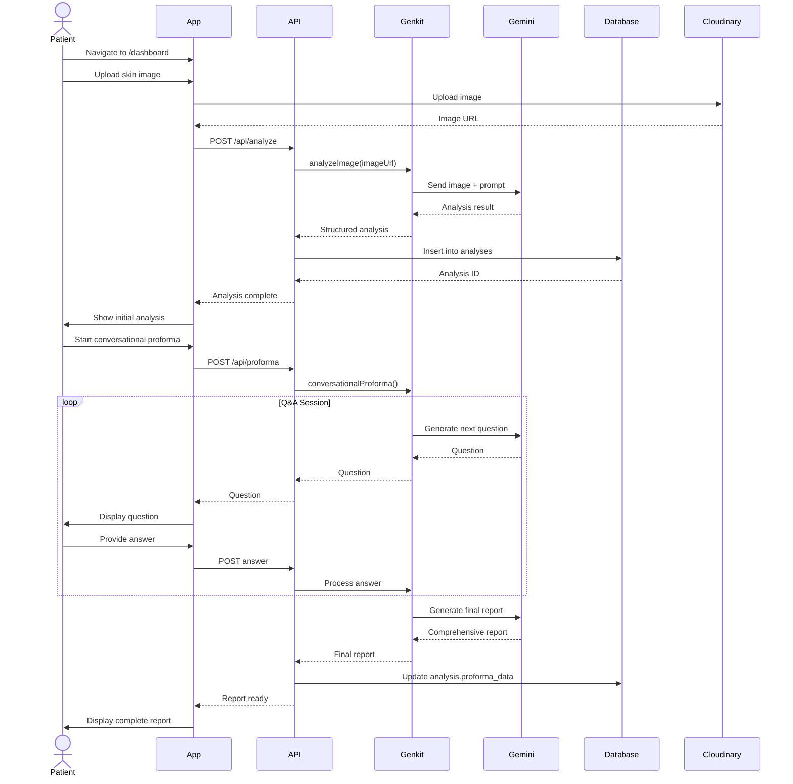
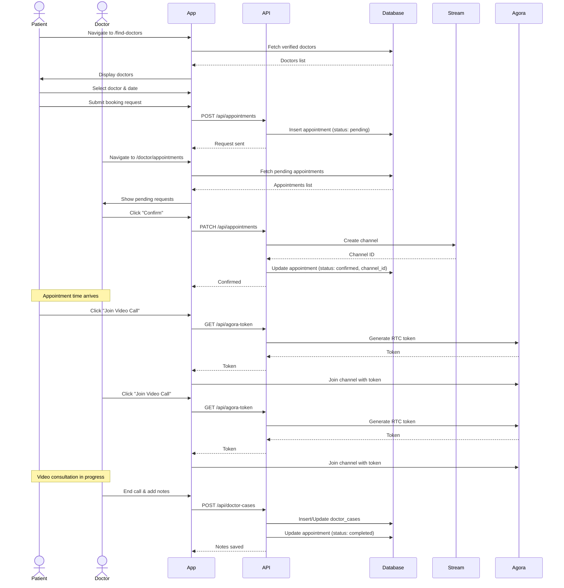
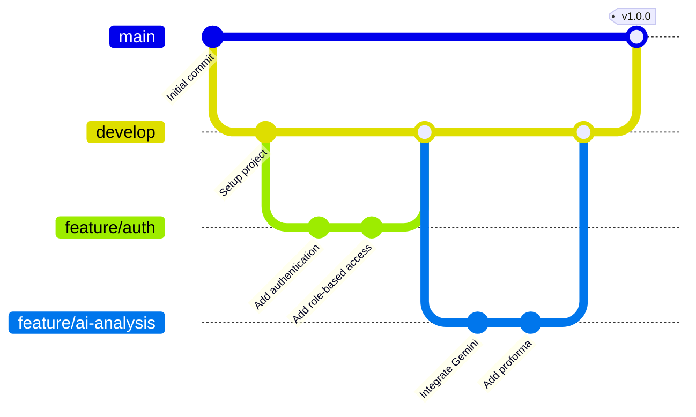

# 🏥 DermiAssist-AI: Intelligent Dermatology Platform

<div align="center">

**AI-Powered Dermatology Platform for Patients, Doctors, and Administrators**

[](https://nextjs.org/)
[](https://reactjs.org/)
[](https://www.typescriptlang.org/)
[](https://supabase.com/)
[](https://vercel.com/)

</div>

---

## 📋 Table of Contents

- [Overview](#-overview)
- [Key Features](#-key-features)
- [Tech Stack](#-tech-stack)
- [System Architecture](#-system-architecture)
- [Database Schema](#-database-schema)
- [User Flows](#-user-flows)
- [Development Methodology](#-development-methodology)
- [Getting Started](#-getting-started)
- [Project Structure](#-project-structure)
- [API Documentation](#-api-documentation)
- [Security](#-security)
- [Performance Optimization](#-performance-optimization)
- [Deployment](#-deployment)
- [Contributing](#-contributing)
- [Troubleshooting](#-troubleshooting)

---

## 🎯 Overview

DermiAssist-AI is a comprehensive, AI-powered web application that revolutionizes dermatological care by connecting patients with certified dermatologists through an intelligent platform. Built with Next.js 15, Google's Gemini AI, and Supabase, it provides instant skin analysis, real-time consultations, and comprehensive health tracking.

### Platform Roles

- **👤 Patients**: Upload skin images for AI analysis, connect with doctors, book appointments, track progress
- **👨‍⚕️ Doctors**: Manage appointments, review patient cases, conduct video consultations, maintain case notes
- **👑 Administrators**: Oversee platform operations, verify doctor credentials, manage users, view analytics

---

## ✨ Key Features

### 🤖 AI-Powered Analysis
- **Instant Skin Analysis**: Upload images for immediate AI-powered diagnosis using Google Gemini 1.5 Flash
- **Conversational Proforma**: Interactive chat-based questionnaire for detailed patient history
- **Multilingual Reports**: AI-generated explanations in multiple languages with text-to-speech
- **Progress Tracking**: Visual comparison of skin condition over time
- **Generative Healing Video**: Premium feature using Google Veo to visualize healing progression

### 🏥 Healthcare Management
- **Doctor Discovery**: Search and filter verified dermatologists by specialty and location
- **Appointment Booking**: Seamless scheduling system with calendar integration
- **Real-time Chat**: Secure messaging via Stream for patient-doctor communication
- **Video Consultations**: High-quality video calls powered by Agora RTC
- **Case Management**: Comprehensive patient case files with private doctor notes

### 📊 Analytics & Reporting
- **Dynamic PDF Reports**: Professional-grade downloadable analysis reports
- **Admin Dashboard**: Platform-wide analytics and user management
- **Doctor Dashboard**: Appointment management and patient overview
- **Patient Dashboard**: Personal health timeline and appointment history

### 🔐 Security & Privacy
- **Role-Based Access Control (RBAC)**: Secure authentication with Supabase Auth
- **Row Level Security (RLS)**: Database-level security policies
- **Document Verification**: Multi-step doctor credential verification
- **HIPAA-Compliant Storage**: Secure file storage via Cloudinary
- **Privacy Controls**: User-controlled document visibility settings

---

## 🛠 Tech Stack

### Frontend
| Technology | Version | Purpose |
|------------|---------|---------|
| **Next.js** | 15.5.9 | React framework with App Router, Server Components, and Server Actions |
| **React** | 18.3.1 | UI library for building interactive interfaces |
| **TypeScript** | 5.0 | Type-safe JavaScript for better developer experience |
| **Tailwind CSS** | 3.4.1 | Utility-first CSS framework for rapid UI development |
| **ShadCN UI** | Latest | Accessible, customizable component library |
| **Framer Motion** | 12.26.2 | Animation library for smooth transitions |

### Backend & AI
| Technology | Version | Purpose |
|------------|---------|---------|
| **Google Gemini** | 1.5 Flash | Advanced AI model for skin analysis and report generation |
| **Genkit** | 1.24.0 | AI workflow orchestration and flow management |
| **Supabase** | 2.90.1 | PostgreSQL database with real-time subscriptions |
| **next-themes** | 0.4.4 | Theme management (Light/Dark mode) with React 19 support |
| **Upstash Redis** | 1.36.2 | Serverless Redis for caching and rate limiting |

### Real-time Communication
| Technology | Version | Purpose |
|------------|---------|---------|
| **Stream Chat** | 9.28.0 | Real-time messaging infrastructure |
| **Agora RTC** | 2.1.0 | Video calling and WebRTC implementation |

### File Storage & Media
| Technology | Version | Purpose |
|------------|---------|---------|
| **Cloudinary** | 2.2.0 | Cloud-based image and document storage |
| **html2canvas** | 1.4.1 | Client-side screenshot generation |
| **jsPDF** | 4.0.0 | PDF generation for reports |

### Development Tools
| Technology | Version | Purpose |
|------------|---------|---------|
| **ESLint** | Latest | Code linting and quality assurance |
| **Prettier** | Latest | Code formatting |
| **Turbopack** | Latest | Fast bundler for Next.js development |

---

## 🏗 System Architecture

### High-Level Architecture



### Component Architecture



---

## 🗄 Database Schema

### Entity Relationship Diagram



### Database Tables Overview

| Table | Purpose | Key Fields |
|-------|---------|------------|
| `profiles` | User profile information | `user_id`, `role`, `full_name`, `avatar_url` |
| `analyses` | AI skin analysis results | `user_id`, `image_url`, `analysis_result`, `proforma_data` |
| `appointments` | Doctor-patient appointments | `patient_id`, `doctor_id`, `appointment_date`, `status` |
| `connection_requests` | Patient-doctor connection requests | `patient_id`, `doctor_id`, `status` |
| `contact_requests` | Doctor role change requests | `user_id`, `status`, `documents`, `documents_public` |
| `doctor_cases` | Doctor's patient case files | `doctor_id`, `patient_id`, `analysis_id`, `notes` |

---

## 🔄 User Flows

### 1. User Authentication Flow



### 2. Doctor Role Change Request Flow



### 3. AI Skin Analysis Flow



### 4. Appointment Booking & Video Consultation Flow



---

### Development Approach

I follow an **Agile development approach** with continuous iteration and improvement:

1. **Sprint Planning**: Set clear 2-week objectives
2. **Progress Tracking**: Regular self-sync on objectives and blockers
3. **Quality Assurance**: Comprehensive testing before deployment
4. **Retrospectives**: Regular reflection and performance improvement

### Code Quality Standards

- **TypeScript**: Strict type checking enabled
- **ESLint**: Enforced linting rules
- **Prettier**: Consistent code formatting
- **Component-Driven**: Reusable, modular components
- **Server-First**: Leverage Next.js Server Components and Server Actions
- **Performance**: Optimized images, lazy loading, code splitting

### Git Workflow



### Testing Strategy

| Test Type | Tools | Coverage |
|-----------|-------|----------|
| **Unit Tests** | Jest, React Testing Library | Component logic, utilities |
| **Integration Tests** | Playwright | API routes, database operations |
| **E2E Tests** | Playwright | Critical user flows |
| **Visual Regression** | Percy | UI consistency |
| **Performance** | Lighthouse, Web Vitals | Load times, Core Web Vitals |

---

## 🚀 Getting Started

### Prerequisites

- **Node.js**: 18.x or higher
- **npm**: 9.x or higher
- **Supabase Account**: For database and authentication
- **Google AI Studio**: For Gemini API key
- **Cloudinary Account**: For file storage
- **Stream Account**: For real-time chat
- **Agora Account**: For video calls
- **Upstash Account**: For Redis caching

### Environment Setup

Create a `.env` file in the root directory:

```bash
# Supabase Configuration
NEXT_PUBLIC_SUPABASE_URL="your_supabase_project_url"
NEXT_PUBLIC_SUPABASE_ANON_KEY="your_supabase_anon_key"
SUPABASE_SERVICE_ROLE_KEY="your_supabase_service_role_key"

# Google AI (Gemini) API Key
GEMINI_API_KEY="your_gemini_api_key"

# Cloudinary Credentials
CLOUDINARY_CLOUD_NAME="your_cloudinary_cloud_name"
CLOUDINARY_API_KEY="your_cloudinary_api_key"
CLOUDINARY_API_SECRET="your_cloudinary_api_secret"

# Stream Credentials
NEXT_PUBLIC_STREAM_API_KEY="your_stream_api_key"
STREAM_API_SECRET="your_stream_api_secret"

# Agora Credentials
NEXT_PUBLIC_AGORA_APP_ID="your_agora_app_id"
AGORA_APP_CERTIFICATE="your_agora_app_certificate"

# Upstash Redis
UPSTASH_REDIS_REST_URL="your_upstash_redis_rest_url"
UPSTASH_REDIS_REST_TOKEN="your_upstash_redis_rest_token"
```

### Installation Steps

#### 1. Clone the Repository

```bash
git clone https://github.com/yourusername/dermiassist.git
cd dermiassist
```

#### 2. Install Dependencies

```bash
npm install
```

#### 3. Configure Supabase

Ensure you have a Supabase project created with **PostgreSQL** and **Supabase Auth** (Email/Password provider) enabled.

Apply database migrations in order from the `supabase_migrations/` directory. For a fresh setup, using the **Master Integrated Schema** is highly recommended.

**Database Migrations (Sequential Order)**

| # | File | Description |
|---|------|-------------|
| 01 | `01_profiles_table.sql` | Core user profile entity with RBAC fields |
| 02 | `02_analyses_table.sql` | AI analysis results and history |
| 03 | `03_appointments_table.sql` | Primary appointment entity |
| 04 | `04_doctor_cases_table.sql` | Case file management for doctors |
| 05 | `05_contact_requests_table.sql` | Role-change and contact request logging |
| 06 | `06_connection_requests_table.sql` | Patient-doctor link management |
| 07 | `07_storage_bucket.sql` | Document verification bucket configuration |
| 08 | `08_email_uniqueness.sql` | Constraints and auto-profile triggers |
| 09 | `09_admin_rls_policies.sql` | Global Admin access control policies |
| 10 | `10_doctor_profile_fields.sql` | Professional metadata fields |
| 11 | `11_documents_public_field.sql` | Privacy controls for verification docs |
| 12 | `12_delete_user_trigger.sql` | Cascade deletion for account removal |
| 13 | `13_add_signature_url.sql` | Digital signature field integration |
| 14 | `14_schema_fixes.sql` | Application-specific column snapshots |
| 15 | `15_doctor_reviews_table.sql` | Patient feedback and rating system |
| 16 | `16_policies_fix.sql` | Cross-role data visibility patches |
| 17 | `17_fix_doctor_columns.sql` | Verification status logic updates |
| 18 | `18_fix_connection_requests_rls.sql` | Stream Chat integration security rules |
| 19 | `19_fix_appointments_columns.sql` | Advanced booking form field support |

**Recommended Migration Method:**

```bash
# Unified Setup (Fastest)
# 1. Open the Supabase SQL Editor
# 2. Copy/Paste the content of supabase_migrations/master_integrated_schema.sql
# 3. Run the complete script once.
```

> **Note**: All migrations are idempotent. The `master_integrated_schema.sql` contains the combined logic of all 19 files in the exact execution order.

#### 4. Run Development Servers

You need to run both the Next.js app and Genkit AI flows:

**Terminal 1: Next.js Application**
```bash
npm run dev
```
Access at: `http://localhost:9002`

**Terminal 2: Genkit AI Flows**
```bash
npm run genkit:dev
```
Access Genkit UI at: `http://localhost:4000`

#### 5. Create Admin User (Optional)

To create an admin user, sign up normally and then run this SQL in Supabase:

```sql
UPDATE profiles 
SET role = 'admin' 
WHERE user_id = 'your-user-id';
```

---

## 📁 Project Structure

```
dermiassist/
├── src/
│   ├── app/                          # Next.js App Router
│   │   ├── (app)/                    # Main application routes
│   │   │   ├── dashboard/            # Patient dashboard
│   │   │   ├── profile/              # User profile management
│   │   │   ├── find-doctors/         # Doctor discovery
│   │   │   ├── appointments/         # Appointment management
│   │   │   ├── my-requests/          # Role change requests
│   │   │   └── analysis/             # AI analysis results
│   │   ├── (auth)/                   # Authentication pages
│   │   │   ├── login/                # Login page
│   │   │   └── signup/               # Signup page
│   │   ├── admin/                    # Admin dashboard
│   │   │   └── dashboard/            # Admin panel
│   │   ├── doctor/                   # Doctor dashboard
│   │   │   ├── dashboard/            # Doctor home
│   │   │   ├── appointments/         # Manage appointments
│   │   │   └── cases/                # Patient case files
│   │   ├── api/                      # API routes
│   │   │   ├── analyze/              # AI analysis endpoint
│   │   │   ├── appointments/         # Appointment CRUD
│   │   │   ├── role-change/          # Role change requests
│   │   │   ├── stream-token/         # Stream chat token
│   │   │   ├── agora-token/          # Agora RTC token
│   │   │   └── upload-documents/     # Document upload
│   │   ├── globals.css               # Global styles
│   │   ├── layout.tsx                # Root layout
│   │   └── page.tsx                  # Landing page
│   ├── components/                   # Reusable components
│   │   ├── ui/                       # ShadCN UI components
│   │   ├── chat/                     # Chat components
│   │   ├── DoctorProfileModal.tsx    # Doctor profile viewer
│   │   ├── AnalysisCard.tsx          # Analysis result card
│   │   └── AppointmentCard.tsx       # Appointment display
│   ├── hooks/                        # Custom React hooks
│   │   ├── useAuth.ts                # Authentication hook
│   │   ├── useSupabase.ts            # Supabase client hook
│   │   └── useStreamChat.ts          # Stream chat hook
│   ├── lib/                          # Utilities and configurations
│   │   ├── supabase/                 # Supabase clients
│   │   │   ├── client.ts             # Client-side client
│   │   │   ├── server.ts             # Server-side client
│   │   │   └── middleware.ts         # Auth middleware
│   │   ├── redis/                    # Redis utilities
│   │   │   └── ai-cache.ts           # AI response caching
│   │   ├── actions.ts                # Server actions
│   │   └── utils.ts                  # Helper functions
│   ├── ai/                           # Genkit AI flows
│   │   ├── flows/                    # AI flow definitions
│   │   │   ├── analyze-image.ts      # Image analysis flow
│   │   │   ├── conversational-proforma.ts  # Proforma flow
│   │   │   ├── explain-report.ts     # Report explanation
│   │   │   └── generate-healing-video.ts   # Video generation
│   │   ├── genkit.ts                 # Genkit configuration
│   │   └── dev.ts                    # Genkit dev server
│   └── types/                        # TypeScript type definitions
│       ├── database.ts               # Database types
│       └── index.ts                  # Shared types
├── supabase_migrations/              # Database migrations (01-19)
│   ├── utils/                        # DB Diagnostic scripts
│   └── master_integrated_schema.sql  # Combined schema for production setup
├── public/                           # Static assets
│   ├── images/
│   └── icons/
├── .env                              # Environment variables (not in git)
├── .gitignore                        # Git ignore rules
├── next.config.ts                    # Next.js configuration
├── tailwind.config.ts                # Tailwind CSS configuration
├── tsconfig.json                     # TypeScript configuration
├── package.json                      # Dependencies
└── README.md                         # This file
```

---

## 📡 API Documentation

### Authentication Endpoints

| Endpoint | Method | Description | Auth Required |
|----------|--------|-------------|---------------|
| `/api/auth/signup` | POST | Create new user account | No |
| `/api/auth/login` | POST | User login | No |
| `/api/auth/logout` | POST | User logout | Yes |
| `/api/check-email` | POST | Check if email exists | No |

### Analysis Endpoints

| Endpoint | Method | Description | Auth Required |
|----------|--------|-------------|---------------|
| `/api/analyze` | POST | Analyze skin image with AI | Yes (Patient) |
| `/api/proforma` | POST | Start conversational proforma | Yes (Patient) |
| `/api/explain-report` | POST | Get multilingual explanation | Yes (Patient) |
| `/api/generate-video` | POST | Generate healing video | Yes (Patient) |

### Appointment Endpoints

| Endpoint | Method | Description | Auth Required |
|----------|--------|-------------|---------------|
| `/api/appointments` | GET | Get user's appointments | Yes |
| `/api/appointments` | POST | Create appointment request | Yes (Patient) |
| `/api/appointments/:id` | PATCH | Update appointment status | Yes (Doctor) |
| `/api/appointments/:id` | DELETE | Cancel appointment | Yes |

### Role Change Endpoints

| Endpoint | Method | Description | Auth Required |
|----------|--------|-------------|---------------|
| `/api/role-change` | POST | Submit role change request | Yes (Patient) |
| `/api/role-change/:id` | PATCH | Update request status | Yes (Admin) |
| `/api/upload-documents` | POST | Upload verification docs | Yes (Patient) |

### Real-time Communication

| Endpoint | Method | Description | Auth Required |
|----------|--------|-------------|---------------|
| `/api/stream-token` | GET | Get Stream chat token | Yes |
| `/api/agora-token` | GET | Get Agora RTC token | Yes |

---

## 🔐 Security

### Authentication & Authorization

- **Supabase Auth**: Email/password authentication with JWT tokens
- **Row Level Security (RLS)**: Database-level access control
- **Role-Based Access Control**: Patient, Doctor, Admin roles
- **Session Management**: Secure cookie-based sessions

### Data Protection

- **Encryption at Rest**: All data encrypted in Supabase
- **Encryption in Transit**: HTTPS/TLS for all communications
- **Environment Variables**: Sensitive keys stored securely
- **Input Validation**: Zod schemas for all user inputs
- **SQL Injection Prevention**: Parameterized queries

### File Upload Security

- **File Type Validation**: Only allowed image/document types
- **File Size Limits**: Maximum 10MB per file
- **Virus Scanning**: Cloudinary automatic scanning
- **Access Control**: Private URLs with signed tokens

### Best Practices

1. **Never commit `.env` files**
2. **Rotate API keys regularly**
3. **Use service role key only server-side**
4. **Implement rate limiting on API routes**
5. **Sanitize all user inputs**
6. **Keep dependencies updated**

---

## ⚡ Performance Optimization

### Frontend Optimizations

- **Server Components**: Reduce client-side JavaScript
- **Image Optimization**: Next.js Image component with automatic WebP
- **Code Splitting**: Dynamic imports for heavy components
- **Lazy Loading**: Load components on demand
- **Font Optimization**: Next.js font optimization

### Backend Optimizations

- **Redis Caching**: Cache AI responses and frequent queries
- **Database Indexing**: Optimized queries with proper indexes
- **Connection Pooling**: Supabase connection management
- **Edge Functions**: Deploy API routes to edge network

### AI Optimizations

- **Response Caching**: Cache similar AI queries
- **Streaming Responses**: Stream AI output for faster perceived performance
- **Batch Processing**: Process multiple requests efficiently
- **Model Selection**: Use appropriate model size for task

### Monitoring

- **Vercel Analytics**: Track Core Web Vitals
- **Supabase Monitoring**: Database performance metrics
- **Error Tracking**: Sentry for error monitoring
- **Uptime Monitoring**: Track service availability

---

## 🌐 Deployment

### Vercel Deployment (Recommended)

#### Prerequisites
- Vercel account
- GitHub repository

#### Steps

1. **Connect Repository**
   ```bash
   # Install Vercel CLI
   npm i -g vercel
   
   # Login and deploy
   vercel login
   vercel
   ```

2. **Configure Environment Variables**
   - Go to Vercel Dashboard → Project Settings → Environment Variables
   - Add all variables from `.env`

3. **Configure Build Settings**
   - Build Command: `npm run build`
   - Output Directory: `.next`
   - Install Command: `npm install`

4. **Deploy**
   ```bash
   vercel --prod
   ```

### Production Checklist

- [ ] All environment variables configured
- [ ] Database migrations applied to production
- [ ] Supabase RLS policies enabled
- [ ] Custom domain configured (optional)
- [ ] SSL certificate active
- [ ] Error tracking configured
- [ ] Analytics enabled
- [ ] Performance monitoring active
- [ ] Backup strategy in place

---

## 🤝 Contributing

Contributions are welcome! Please follow these guidelines:

### Development Workflow

1. **Fork the repository**
2. **Create a feature branch**
   ```bash
   git checkout -b feature/amazing-feature
   ```
3. **Make your changes**
4. **Run tests**
   ```bash
   npm run test
   npm run lint
   npm run typecheck
   ```
5. **Commit your changes**
   ```bash
   git commit -m "Add amazing feature"
   ```
6. **Push to your fork**
   ```bash
   git push origin feature/amazing-feature
   ```
7. **Open a Pull Request**

### Code Style

- Follow existing code patterns
- Use TypeScript for type safety
- Write meaningful commit messages
- Add comments for complex logic
- Update documentation as needed

### Pull Request Guidelines

- Describe what your PR does
- Reference related issues
- Include screenshots for UI changes
- Ensure all tests pass
- Submit your PR for review

---

## 🐛 Troubleshooting

### Common Issues

#### Issue: "Module not found" errors

**Solution:**
```bash
# Clear node modules and reinstall
rm -rf node_modules package-lock.json
npm install
```

#### Issue: Supabase connection errors

**Solution:**
1. Verify environment variables are correct
2. Check Supabase project is active
3. Ensure RLS policies are properly configured
4. Check network connectivity

#### Issue: Genkit flows not working

**Solution:**
```bash
# Ensure Genkit dev server is running
npm run genkit:dev

# Check GEMINI_API_KEY is set correctly
echo $GEMINI_API_KEY
```

#### Issue: Build errors with Next.js

**Solution:**
```bash
# Clear Next.js cache
rm -rf .next

# Rebuild
npm run build
```

#### Issue: TypeScript errors

**Solution:**
```bash
# Run type checking
npm run typecheck

# Check tsconfig.json is correct
```


## 🙏 Acknowledgments

- **Google AI Studio** for Gemini API
- **Vercel** for hosting platform
- **Supabase** for backend infrastructure
- **Stream** for real-time chat
- **Agora** for video calling
- **Cloudinary** for media storage
- **ShadCN** for UI components

---

## 📞 Contact

- **Website**: https://dermiassist.live
- **Email**: khwajamainuddinmomin@gmail.com
- **GitHub**: https://github.com/salman-momin08/dermiassist


---

<div align="center">

**Built with ❤️ using Next.js, Google AI, and Supabase**

⭐ Star me on GitHub if you find this project useful!

</div>
