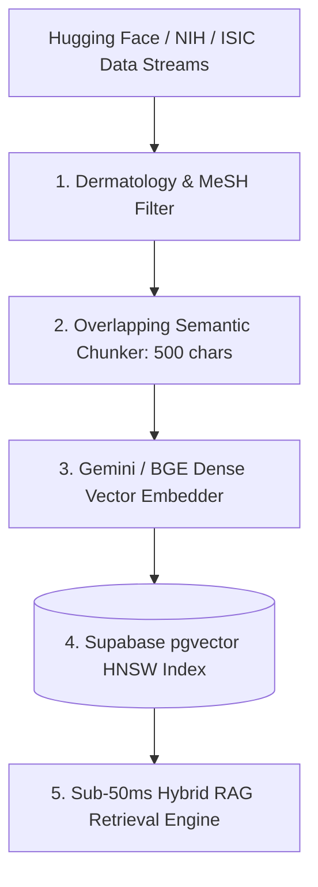

# 🌐 Clinical Dermatology Datasets & Bulk Ingestion Guide

This comprehensive guide details the gold-standard open-access datasets, multimodal vision corpora, and pre-trained medical foundation embeddings integrated into **DermiAssist-AI**.

---

## 📋 Table of Contents

- [1. Text Datasets (Clinical Knowledge Base & RAG)](#1-text-datasets-clinical-knowledge-base--rag)
- [2. Image & Multimodal Datasets (Vision & Benchmarks)](#2-image--multimodal-datasets-vision--benchmarks)
- [3. Pre-Trained Medical Foundation Models & Embeddings](#3-pre-trained-medical-foundation-models--embeddings)
- [4. Automated Ingestion Pipeline Scripts](#4-automated-ingestion-pipeline-scripts)
- [5. Master Dataset Matrix](#5-master-dataset-matrix)
- [6. High-Throughput pgvector Ingestion Architecture](#6-high-throughput-pgvector-ingestion-architecture)

---

## 1. Text Datasets (Clinical Knowledge Base & RAG)

### A. MedQA / USMLE Clinical Q&A
- **Description**: Real-world US Medical Licensing Examination (USMLE) multiple-choice questions and clinical scenario vignettes.
- **Hugging Face**: [`bigbio/med_qa`](https://huggingface.co/datasets/bigbio/med_qa)
- **Use Case**: Grounds diagnostic reasoning, differential synthesis, and step-by-step clinical triage.
- **Python Download**:
  ```python
  from datasets import load_dataset
  med_qa = load_dataset("bigbio/med_qa", split="train", streaming=True)
  ```

### B. MedQuAD (NIH Medical Question-Answer Dataset)
- **Description**: 47,457 medical questions and authoritative answers created from 12 NIH websites (e.g. Cancer.gov, MedlinePlus, Genetic and Rare Diseases Information Center).
- **Hugging Face**: [`lavita/MedQuAD`](https://huggingface.co/datasets/lavita/MedQuAD)
- **GitHub**: [NIH-MedQuAD GitHub Repository](https://github.com/abachaa/MedQuAD)
- **Use Case**: Authoritative clinical care instructions, patient do's & don'ts, and disease pathophysiology.

### C. PubMedQA (Biomedical Research Context)
- **Description**: Biomedical research literature question-answering dataset collected from PubMed abstracts with expert yes/no/maybe labels and detailed clinical context.
- **Hugging Face**: [`pubmed_qa`](https://huggingface.co/datasets/pubmed_qa)
- **Official Portal**: [PubMedQA Portal](https://pubmedqa.github.io/)
- **Use Case**: Evidence-based citation generation and peer-reviewed clinical trial grounding.

---

## 2. Image & Multimodal Datasets (Vision & Benchmarks)

### A. Google SCIN (Skin Condition Image Network)
- **Description**: Crowdsourced dermatology dataset collected by Google Health with Fitzpatrick skin types I–VI representing diverse global populations.
- **Kaggle**: [Google SCIN Dataset on Kaggle](https://www.kaggle.com/datasets/emmanuelkiriinya/scin-google-dermatology-dataset)
- **CLI Download**:
  ```bash
  kaggle datasets download -d emmanuelkiriinya/scin-google-dermatology-dataset
  ```

### B. ISIC Archive (International Skin Imaging Collaboration)
- **Description**: Over 100,000 dermoscopy images covering melanoma, nevus, basal cell carcinoma, actinic keratosis, and dermatofibroma.
- **Hugging Face (ISIC 2019 Resized)**: [`MKZuziak/ISIC_2019_224`](https://huggingface.co/datasets/MKZuziak/ISIC_2019_224)
- **Kaggle (ISIC 2024 Challenge)**: [ISIC 2024 Challenge on Kaggle](https://www.kaggle.com/competitions/isic-2024-challenge/data)
- **Python Download**:
  ```python
  from datasets import load_dataset
  isic_data = load_dataset("MKZuziak/ISIC_2019_224")
  ```

### C. HAM10000 (Human Against Machine - 10,000 Dermatoscopic Images)
- **Description**: Benchmark dermoscopy dataset for 7 major diagnostic categories (Melanoma, Melanocytic Nevi, Basal Cell Carcinoma, Actinic Keratoses, Benign Keratosis, Dermatofibroma, Vascular Lesions).
- **Kaggle**: [HAM10000 on Kaggle](https://www.kaggle.com/datasets/kmader/skin-cancer-mnist-ham10000)
- **Harvard Dataverse**: [HAM10000 Dataverse Repository](https://dataverse.harvard.edu/dataset.xhtml?persistentId=doi:10.7910/DVN/DB2019)

### D. PAD-UFES-20 (Smartphone-Captured Lesions)
- **Description**: Real-world smartphone camera photos of skin lesions with biopsy-verified ground-truth and patient metadata (age, gender, lesion fitzpatrick, itch).
- **Mendeley Data**: [PAD-UFES-20 Dataset](https://data.mendeley.com/datasets/5f9wbny22m/1)

---

## 3. Pre-Trained Medical Foundation Models & Embeddings

### Google Derm Foundation Embeddings
- **Description**: Deep learning feature embeddings trained specifically on dermatological images across multiple modalities and Fitzpatrick skin types.
- **GitHub**: [Google-Health/derm-foundation](https://github.com/Google-Health/derm-foundation)
- **Hugging Face**: [`google/derm-foundation`](https://huggingface.co/google/derm-foundation)
- **Use Case**: Zero-shot and few-shot lesion classification, similarity retrieval in image space, and multimodal vector search.

---

## 4. Automated Ingestion Pipeline Scripts

We provide ready-to-run Python pipelines in `ai_service/ingestion/`:

### 1. Ingest Text Datasets (MedQA, MedQuAD, PubMedQA)
```bash
python ai_service/ingestion/download_clinical_datasets.py
```
*Extracts dermatology-filtered Q&As and exports to `src/ai/rag/datasets/huggingface-medical-knowledge.json`.*

### 2. Generate Multimodal Vision Benchmark Cases
```bash
python ai_service/ingestion/process_multimodal_benchmarks.py
```
*Builds standardized multimodal eval cases in `src/ai/eval/datasets/isic-multimodal-benchmarks.json`.*

---

## 5. Master Dataset Matrix

| Dataset | Modality | Records | License | Primary Role in DermiAssist-AI |
|---|---|---|---|---|
| **MedQA (USMLE)** | Text Q&A | 12,000+ | MIT / Research | Step-by-Step Diagnostic Reasoning |
| **MedQuAD (NIH)** | Text Q&A | 47,457 | Public Domain | Authoritative Patient Guidance & Guidelines |
| **PubMedQA** | Biomedical Text | 273,000+ | MIT | Peer-Reviewed Evidence & Citations |
| **ISIC 2019/2024** | Dermoscopy Images | 100,000+ | CC-BY-NC | Multimodal Vision Lesion Benchmarks |
| **HAM10000** | Dermoscopy Images | 10,015 | CC-BY-NC 4.0 | Skin Cancer Classifier Evaluation |
| **Google SCIN** | Multimodal Photos | 10,000+ | Apache 2.0 | Fitzpatrick I–VI Bias Calibration |
| **Derm Foundation** | Pretrained Weights | Foundation | Apache 2.0 | Visual Feature Embedding Vectors |

---

## 6. High-Throughput pgvector Ingestion Architecture


