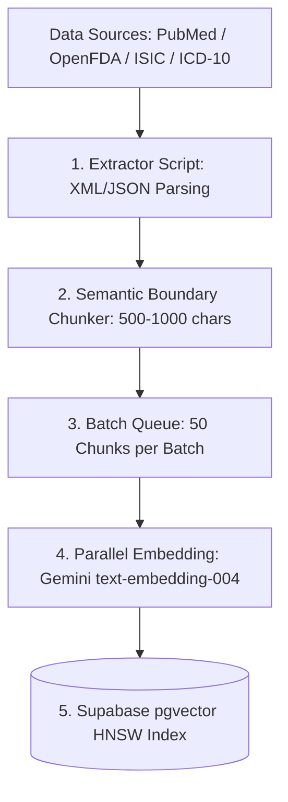

# 🌐 Real-World Bulk Medical Data Acquisition & Ingestion Guide

This guide details how to source, extract, chunk, embed, and ingest **large-scale real-world medical data** into Supabase `pgvector` for production medical AI systems like **DermiAssist-AI**.

---

## 📋 Table of Contents

- [1. Authoritative Open Datasets & Sources](#1-authoritative-open-datasets--sources)
- [2. Dataset Comparison Matrix](#2-dataset-comparison-matrix)
- [3. Bulk Ingestion Architecture (ETL Pipeline)](#3-bulk-ingestion-architecture-etl-pipeline)
- [4. Batch Embedding & Insertion Code Template](#4-batch-embedding--insertion-code-template)
- [5. Scaling pgvector for 100,000+ Vectors](#5-scaling-pgvector-for-100000-vectors)

---

## 1. Authoritative Open Datasets & Sources

### A. PubMed / MEDLINE (NCBI)
- **Content**: 35+ million peer-reviewed biomedical abstracts and full-text papers.
- **Dermatology Focus**: Filter using MeSH (Medical Subject Headings) terms: `"Dermatology"[Mesh]` or `"Skin Diseases"[Mesh]`.
- **Acquisition Method**:
  - **FTP Bulk Dumps**: [NCBI FTP MEDLINE Dumps](https://ftp.ncbi.nlm.nih.gov/pubmed/baseline/) (XML files).
  - **Entrez Direct (EDirect) CLI**:
    ```bash
    # Download 5,000 dermatology abstracts in XML format
    esearch -db pubmed -query "Dermatology[Mesh] AND 2020:2024[DP]" | efetch -format abstract > derm_abstracts.xml
    ```

---

### B. ISIC Archive (International Skin Imaging Collaboration)
- **Content**: 100,000+ dermoscopic & clinical lesion images with expert ground-truth diagnoses (Melanoma, Nevus, Basal Cell Carcinoma, Eczema).
- **Use Case**: Multimodal vision model fine-tuning & evaluation benchmarks.
- **Acquisition API**:
  ```bash
  # Query ISIC Archive API for metadata & diagnoses
  curl -X GET "https://api.isic-archive.com/api/v2/images/?limit=1000"
  ```

---

### C. OpenFDA (US Food & Drug Administration API)
- **Content**: FDA drug labels, active ingredients, clinical indications, and drug-drug interactions.
- **Use Case**: Grounding topical and oral dermatology drug recommendations.
- **Bulk Access**: [OpenFDA Download Page](https://open.fda.gov/data/downloads/) or REST API:
  ```bash
  curl -X GET "https://api.fda.gov/drug/label.json?search=openfda.pharm_class_cs:dermatological&limit=100"
  ```

---

### D. UMLS & ICD-10-CM Medical Dictionary (NLM)
- **Content**: Complete clinical taxonomy containing ICD-10-CM codes, SNOMED CT, and RxNorm.
- **Use Case**: Diagnostic code classification & clinical term normalization.
- **Access**: [UMLS Metathesaurus Download](https://www.nlm.nih.gov/research/umls/).

---

## 2. Dataset Comparison Matrix

| Dataset | Data Type | Record Count | Licensing | Primary Use in DermiAssist-AI |
|---------|-----------|--------------|-----------|-------------------------------|
| **PubMed / MEDLINE** | Text / Clinical Abstracts | 35,000,000+ | Public Domain | RAG Vector Literature Search |
| **ISIC Archive** | Multimodal Image + Metadata | 100,000+ | CC-BY-NC / Open | Vision Lesion Benchmarking |
| **OpenFDA** | Structured JSON Drug Labels | 150,000+ | Open Government | Drug Interaction Tool |
| **UMLS / ICD-10** | XML / CSV Taxonomy | 70,000+ Codes | Public / NLM License | Clinical Classification |
| **AAD Clinical Guidelines** | PDF / HTML Manuals | 200+ Guidelines | Fair Use / Citation | Diagnostic Guidelines Grounding |

---

## 3. Bulk Ingestion Architecture (ETL Pipeline)



---

## 4. Batch Embedding & Insertion Code Template

When ingesting thousands of records, sequential insertion is slow. Use **batched promises** and Supabase bulk array insertion:

```typescript
import { generateEmbedding } from './embeddings';
import { createClient } from '@supabase/supabase-js';

const supabase = createClient(process.env.NEXT_PUBLIC_SUPABASE_URL!, process.env.SUPABASE_SERVICE_ROLE_KEY!);
const BATCH_SIZE = 50;

export async function bulkIngestClinicalPassages(passages: Array<{ title: string; content: string; category: string; source: string }>) {
    console.log(`🚀 Starting bulk ingestion of ${passages.length} passages...`);

    for (let i = 0; i < passages.length; i += BATCH_SIZE) {
        const batch = passages.slice(i, i + BATCH_SIZE);

        // Generate 50 embeddings in parallel
        const batchWithEmbeddings = await Promise.all(
            batch.map(async (doc) => {
                const embedding = await generateEmbedding(doc.content);
                return {
                    title: doc.title,
                    condition_category: doc.category,
                    content: doc.content,
                    source: doc.source,
                    embedding,
                };
            })
        );

        // Bulk insert 50 rows in a single database transaction
        const { error } = await supabase.from('medical_knowledge_chunks').insert(batchWithEmbeddings);

        if (error) {
            console.error(`❌ Batch ${i / BATCH_SIZE + 1} failed:`, error.message);
        } else {
            console.log(`✅ Ingested records ${i + 1} to ${Math.min(i + BATCH_SIZE, passages.length)}`);
        }
    }
}
```

---

## 5. Scaling pgvector for 100,000+ Vectors

When your dataset scales beyond 50,000 vectors, switch the index type in Supabase from `IVFFlat` to **HNSW (Hierarchical Navigable Small World)** for higher query throughput:

```sql
-- Drop old IVFFlat index
DROP INDEX IF EXISTS idx_medical_knowledge_embedding;

-- Create HNSW Index (Superior query accuracy & throughput for >100k vectors)
CREATE INDEX idx_medical_knowledge_hnsw 
ON medical_knowledge_chunks 
USING hnsw (embedding vector_cosine_ops)
WITH (m = 16, ef_construction = 64);
```
