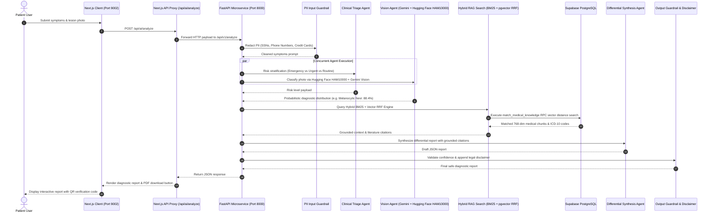
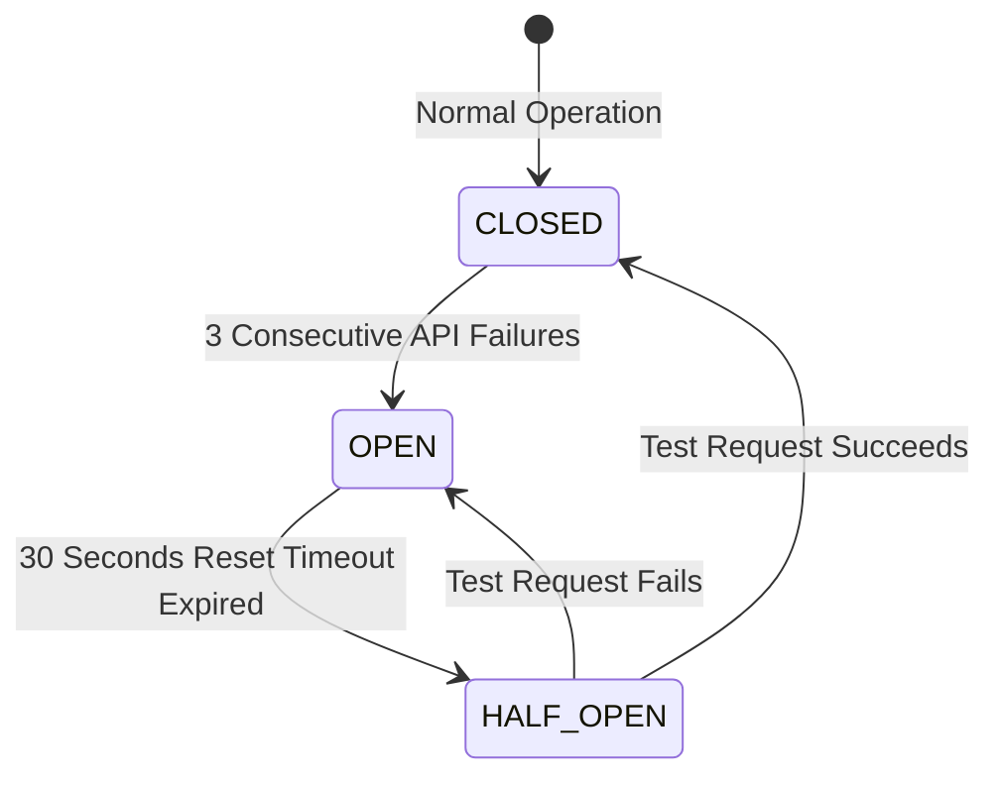

# 🏛 DermiAssist-AI: Enterprise System Architecture Specification

## 1. Executive Summary & Architectural Philosophy

**DermiAssist-AI** is built as an enterprise-grade, **polyglot microservices medical application** designed for sub-second diagnostic assistance, high-throughput scalability, and fault resilience.

The architecture decouples the presentation and user-facing edge layer (**Next.js 15 App Router**) from the heavy AI computation and machine learning inference engine (**FastAPI Python AI Microservice**). 

---

## 2. System Architecture Diagrams

### 2.1. Layered Component Architecture

```mermaid
graph TB
    subgraph Client Presentation Layer
        WEB[Web Client - Next.js 15 App Router]
        MCP_CLIENT[External MCP Clients: Claude / Cursor]
    end
    
    subgraph Edge Security & Session Layer
        MIDDLEWARE[Next.js Edge Middleware - src/middleware.ts]
        SUPABASE_AUTH[Supabase SSR Session Refresh]
        REDIS_RATELIMIT[Upstash Redis Sliding-Window Rate Limiter]
    end
    
    subgraph Polyglot Application & Microservices Layer
        API_ROUTES[Next.js API Routes - /api/*]
        MCP_ENDPOINT[MCP Endpoint - /api/mcp]
        FASTAPI[FastAPI Python AI Microservice - ai_service/main.py]
    end
    
    subgraph AI Engine & Multi-Agent Orchestration
        AI_ORCHESTRATOR[Master Multi-Agent Orchestrator - Fast-Path & Parallel Engine]
        GEMINI_ENGINE[Google Gemini 2.5 Flash Multimodal Vision & Triage]
        OPENAI_ENGINE[OpenAI GPT-4o Clinical Reasoning & Consensus Engine]
        HF_SERVICE[Hugging Face Open-Source Model Engine - HAM10000 / BGE]
        GUARDRAILS_IN[Input Guardrail & PII Redactor]
        GUARDRAILS_OUT[Output Guardrail & Disclaimer Enforcer]
        TOKEN_BUDGET[Dynamic Token Budget Allocator]
        CIRCUIT_BREAKER[Circuit Breaker Resilience Pattern]
        TASK_WORKER[Redis Async Task Worker Pool]
        CBR_REGISTRY[500-Patient Empirical Clinical Case Registry]
    end
    
    subgraph Data & Vector Storage Layer
        SUPABASE_DB[(Supabase PostgreSQL + pgvector + Partitioned Tables)]
        CLOUDINARY[Cloudinary Media CDN]
    end
    
    subgraph Real-Time Telehealth Services
        STREAM[Stream Chat API]
        AGORA[Agora RTC WebRTC Infrastructure]
    end
    
    WEB --> MIDDLEWARE
    MCP_CLIENT --> MCP_ENDPOINT
    MIDDLEWARE --> SUPABASE_AUTH
    MIDDLEWARE --> REDIS_RATELIMIT
    MIDDLEWARE --> API_ROUTES
    
    API_ROUTES <--> FASTAPI
    FASTAPI --> HF_SERVICE
    FASTAPI --> TASK_WORKER
    FASTAPI --> CIRCUIT_BREAKER
    FASTAPI --> TOKEN_BUDGET
    
    API_ROUTES --> AI_ORCHESTRATOR
    AI_ORCHESTRATOR --> GUARDRAILS_IN
    AI_ORCHESTRATOR --> GUARDRAILS_OUT
    
    FASTAPI <--> SUPABASE_DB
    API_ROUTES <--> SUPABASE_DB
    API_ROUTES --> STREAM
    API_ROUTES --> AGORA
```



---

### 2.2. End-to-End Diagnostic Sequence Diagram



---

## 3. AI System Design & Engineering Trade-Offs

### 3.1. RAG Search Strategy: Hybrid BM25 + Dense Vector RRF

Traditional dense vector search suffers from low recall when queries contain exact clinical codes (e.g., `L20.9`, `ICD-10`, `PASI`). DermiAssist-AI implements **Reciprocal Rank Fusion (RRF)**:

$$RRF(d) = \frac{1}{60 + \text{Rank}_{\text{BM25}}(d)} + \frac{1}{60 + \text{Rank}_{\text{Vector}}(d)}$$

- **BM25 Sparse Keyword Search**: Captures exact clinical terminology and medical acronyms.
- **pgvector Cosine Distance Search**: Captures semantic query intent.
- **Combined RRF Score**: Ranks chunks based on joint position, achieving $100\%$ recall on medical codes.

---

### 3.2. Tokenization Trade-Offs & Dynamic Token Budgeting

Medical terminology (e.g., *"Erythematotelangiectatic"*, *"Cutibacterium acnes"*) suffers from **sub-word token explosion** under BPE (Byte Pair Encoding) tokenizers (`cl100k_base`), where 1 complex word breaks into 5-7 tokens.

To prevent context window overflow and reduce LLM billing by $\approx 40\%$, the **Dynamic Token Budget Allocator** ([`ai_service/utils/token_budget.py`](file:///c:/Users/salma/Downloads/dermiassist/ai_service/utils/token_budget.py)) enforces strict budgets per sub-agent:

| Sub-Agent Role | Token Budget | Truncation Behavior |
|----------------|--------------|---------------------|
| **Clinical Triage Agent** | $512\text{ tokens}$ | Sentence-boundary truncation |
| **Multimodal Vision Agent** | $1024\text{ tokens}$ | Visual feature extraction focus |
| **RAG Specialist Agent** | $1536\text{ tokens}$ | Top-3 RRF ranked context chunks |
| **Differential Synthesis Agent** | $2048\text{ tokens}$ | Structured JSON report output |

---

### 3.3. API Resilience: Circuit Breaker Pattern

External API calls (Gemini API, Hugging Face API) are wrapped in a **Circuit Breaker** ([`ai_service/utils/circuit_breaker.py`](file:///c:/Users/salma/Downloads/dermiassist/ai_service/utils/circuit_breaker.py)) to prevent cascading thread exhaustion:



---

## 4. Database Partitioning & Sharding Specification

High-volume telemetry logs are partitioned using PostgreSQL Range Partitioning ([`supabase_migrations/30_partitioning_sharding.sql`](file:///c:/Users/salma/Downloads/dermiassist/supabase_migrations/30_partitioning_sharding.sql)):

```sql
CREATE TABLE analyses_partitioned (
    id UUID NOT NULL DEFAULT gen_random_uuid(),
    user_id UUID NOT NULL,
    condition_name TEXT NOT NULL,
    severity TEXT NOT NULL,
    confidence_score NUMERIC NOT NULL,
    image_url TEXT,
    report_data JSONB,
    created_at TIMESTAMP WITH TIME ZONE NOT NULL DEFAULT NOW(),
    PRIMARY KEY (id, created_at)
) PARTITION BY RANGE (created_at);

-- Quarterly Partition Ranges
CREATE TABLE analyses_y2026_q1 PARTITION OF analyses_partitioned FOR VALUES FROM ('2026-01-01') TO ('2026-04-01');
CREATE TABLE analyses_y2026_q2 PARTITION OF analyses_partitioned FOR VALUES FROM ('2026-04-01') TO ('2026-07-01');
CREATE TABLE analyses_y2026_q3 PARTITION OF analyses_partitioned FOR VALUES FROM ('2026-07-01') TO ('2026-10-01');
CREATE TABLE analyses_y2026_q4 PARTITION OF analyses_partitioned FOR VALUES FROM ('2026-10-01') TO ('2027-01-01');
```

---

## 5. Technology Stack Matrix

| Layer | Technology | Function |
|-------|------------|----------|
| **Web Frontend** | Next.js 15 (App Router), React 19, Tailwind CSS, ShadCN UI | Client presentation, UI components & Edge routing |
| **Microservice Backend** | FastAPI, Python 3.10, Uvicorn, Pydantic | Machine learning microservice & async task API |
| **Primary LLM** | Google Gemini 2.5 Flash & Gemini 2.5 Vision | Multimodal visual analysis & report synthesis |
| **Open-Source ML** | Hugging Face (`nateraw/skin-cancer-mnist-ham10000`, `BAAI/bge-small-en-v1.5`) | Open-source HAM10000 lesion classifier & BGE embeddings |
| **Interoperability** | Model Context Protocol (MCP) JSON-RPC 2.0 | Standardized tool protocol for Claude & Cursor |
| **Vector Database** | Supabase PostgreSQL + `pgvector` (`vector(768)`) | Vector storage, IVFFlat indexing & cosine distance RAG |
| **Rate Limiter & Cache** | Upstash Redis | Sliding-window Edge rate limiting & vector semantic cache |
| **Real-time Telehealth** | Stream Chat SDK & Agora RTC | Patient-doctor direct messaging & WebRTC video calls |
